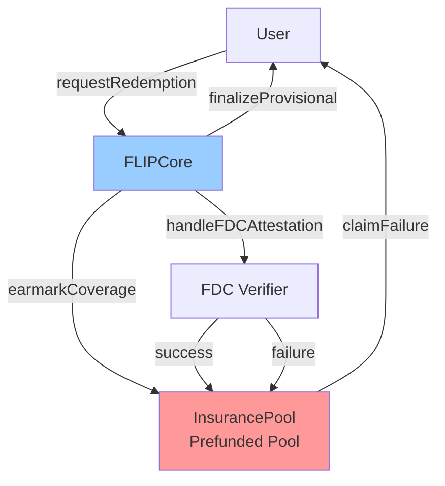
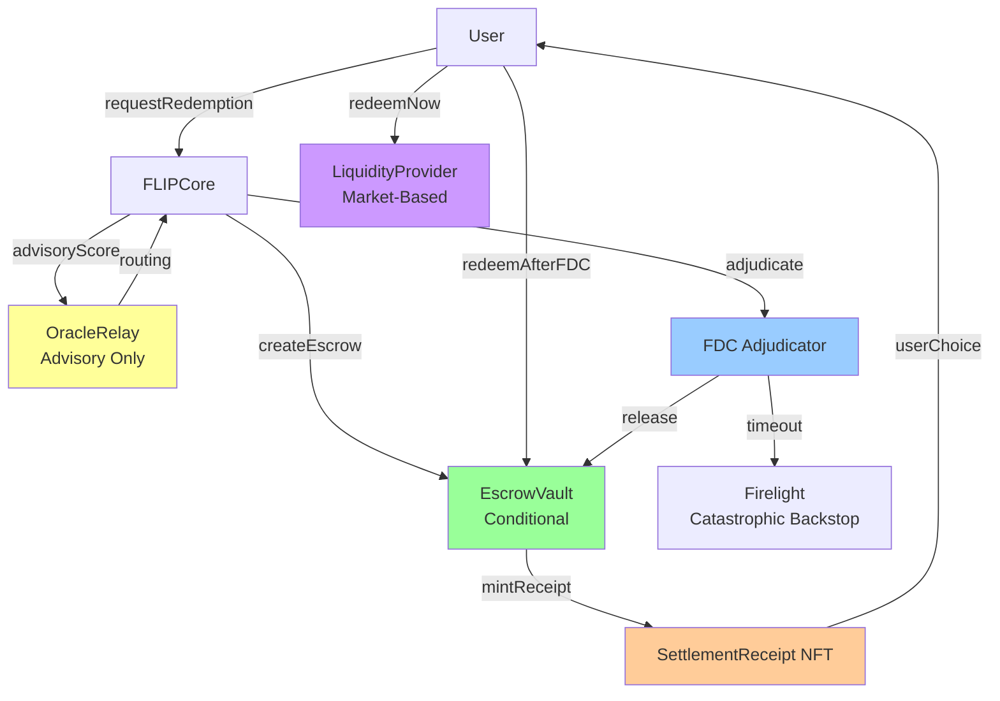

# FLIP v2 Master Implementation Plan

## Executive Summary

This plan transforms FLIP from a capital-intensive prefunded insurance model to a capital-efficient conditional settlement acceleration layer. The transformation addresses Launchpad feedback by:

1. **Replacing prefunded InsurancePool** with **EscrowVault** (no idle capital)
2. **Introducing SettlementReceipt NFTs** for conditional claims
3. **Adding LiquidityProviderRegistry** for market-based, opt-in liquidity
4. **Refactoring OracleRelay** to advisory-only (no capital triggers)
5. **Repositioning FDC** as adjudicator (not just verifier)
6. **Maintaining DeterministicScoring** as advisory routing mechanism

**Capital Efficiency Improvement**: 10-20× reduction in idle capital requirements.

---

## Architecture Overview

### Current Architecture (v1)



**Problems:**

- Large prefunded pool (capital-intensive)
- Direct insurance payouts
- FDC is verifier only
- Scoring directly triggers capital allocation

### Target Architecture (v2)



**Improvements:**

- Escrow-based (no prefunding)
- Market-based liquidity (opt-in)
- FDC as adjudicator
- Scoring is advisory only

---

## Component Transformation Matrix

| Component | Current State | Target State | Action Required |

|-----------|--------------|--------------|-----------------|

| **InsurancePool.sol** | Prefunded pool, immediate payout | EscrowVault.sol | **REPLACE** - New implementation |

| **FLIPCore.sol** | Direct insurance integration | Escrow + receipt minting | **REFACTOR** - Major changes |

| **OracleRelay.sol** | Capital-triggering predictions | Advisory-only routing | **REFACTOR** - Remove capital triggers |

| **OperatorRegistry.sol** | Slashing on mispredictions | Slashing on routing errors | **UPDATE** - Adjust slashing logic |

| **DeterministicScoring.sol** | Direct settlement trigger | Advisory routing score | **UPDATE** - Return routing decisions |

| **PriceHedgePool.sol** | Unchanged | Unchanged | **KEEP** - No changes needed |

| **SettlementReceipt.sol** | Does not exist | ERC-721/1155 NFT | **CREATE** - New contract |

| **LiquidityProviderRegistry.sol** | Does not exist | LP opt-in registry | **CREATE** - New contract |

---

## Implementation Phases

### Phase 1: Core Escrow Infrastructure (Week 1-2)

**Goal**: Replace InsurancePool with EscrowVault and create SettlementReceipt NFT.

#### 1.1 Create EscrowVault.sol

**File**: `contracts/EscrowVault.sol`

**Key Functions**:

```solidity
function createEscrow(uint256 redemptionId, uint256 amount, address asset) external
function releaseOnFDC(uint256 redemptionId, bool success) external
function timeoutRelease(uint256 redemptionId) external
function getEscrowStatus(uint256 redemptionId) external view returns (EscrowStatus)
```

**Key Differences from InsurancePool**:

- No `replenishPool()` - funds come from users or LPs
- No `earmarkCoverage()` - escrow created per redemption
- Conditional release based on FDC adjudication
- Timeout mechanism for edge cases

**Dependencies**: None (new contract)

**Status**: CREATE NEW

#### 1.2 Create SettlementReceipt.sol

**File**: `contracts/SettlementReceipt.sol`

**Implementation Choice**: ERC-721 (non-fungible) vs ERC-1155 (semi-fungible)

**Recommendation**: ERC-721 for simplicity, each receipt is unique.

**Key Functions**:

```solidity
function mintReceipt(address to, uint256 redemptionId, ReceiptMetadata memory) external returns (uint256 tokenId)
function redeemNow(uint256 receiptId) external
function redeemAfterFDC(uint256 receiptId) external
function getReceiptMetadata(uint256 receiptId) external view returns (ReceiptMetadata memory)
```

**Metadata Structure**:

```solidity
struct ReceiptMetadata {
    uint256 redemptionId;
    address asset;
    uint256 amount;
    uint256 haircutRate; // Scaled: 1000000 = 100%
    uint256 createdAt;
    uint256 fdcRoundId;
    bool redeemed;
}
```

**Dependencies**: EscrowVault (for redemption logic)

**Status**: CREATE NEW

#### 1.3 Update FLIPCore.sol - Escrow Integration

**File**: `contracts/FLIPCore.sol`

**Changes Required**:

1. **Replace InsurancePool import**:
   ```solidity
   // OLD
   import "./InsurancePool.sol";
   InsurancePool public immutable insurancePool;
   
   // NEW
   import "./EscrowVault.sol";
   import "./SettlementReceipt.sol";
   EscrowVault public immutable escrowVault;
   SettlementReceipt public immutable settlementReceipt;
   ```

2. **Update `finalizeProvisional()` function**:

   - Remove `insurancePool.earmarkCoverage()` call
   - Add `escrowVault.createEscrow()` call
   - Add `settlementReceipt.mintReceipt()` call
   - Update status to `EscrowCreated` instead of `ProvisionallySettled`

3. **Update `handleFDCAttestation()` function**:

   - Replace `insurancePool.releaseCoverage()` with `escrowVault.releaseOnFDC()`
   - Update receipt status based on FDC outcome

4. **Add new redemption status**:
   ```solidity
   enum RedemptionStatus {
       Pending,
       QueuedForFDC,
       EscrowCreated,        // NEW
       ReceiptRedeemed,      // NEW
       Finalized,
       Failed,
       Timeout               // NEW
   }
   ```


**Dependencies**: EscrowVault, SettlementReceipt

**Status**: REFACTOR

**Estimated Changes**: ~200 lines modified

---

### Phase 2: Market-Based Liquidity (Week 2-3)

**Goal**: Create LiquidityProviderRegistry for opt-in, market-based liquidity.

#### 2.1 Create LiquidityProviderRegistry.sol

**File**: `contracts/LiquidityProviderRegistry.sol`

**Key Functions**:

```solidity
function depositLiquidity(
    address asset,
    uint256 amount,
    uint256 minHaircut,    // Minimum haircut LP accepts (scaled)
    uint256 maxDelay       // Maximum delay LP tolerates (seconds)
) external payable

function withdrawLiquidity(address asset, uint256 amount) external

function matchLiquidity(
    address asset,
    uint256 amount,
    uint256 requestedHaircut
) external returns (address lp, uint256 availableAmount)

function recordSettlement(
    address lp,
    uint256 amount,
    uint256 haircutEarned
) external
```

**LP Position Structure**:

```solidity
struct LPPosition {
    address lp;
    address asset;
    uint256 depositedAmount;
    uint256 availableAmount;
    uint256 minHaircut;      // Scaled: 1000000 = 100%
    uint256 maxDelay;         // Seconds
    uint256 totalEarned;      // Total haircut fees earned
    bool active;
}
```

**Matching Logic**:

- Find LP with `minHaircut <= requestedHaircut`
- Find LP with `availableAmount >= amount`
- Prefer LPs with lower haircut requirements (better UX)
- Record settlement for fee distribution

**Dependencies**: EscrowVault (for settlement tracking)

**Status**: CREATE NEW

#### 2.2 Integrate LP Matching in FLIPCore

**File**: `contracts/FLIPCore.sol`

**Changes Required**:

1. **Add LiquidityProviderRegistry import**:
   ```solidity
   import "./LiquidityProviderRegistry.sol";
   LiquidityProviderRegistry public immutable lpRegistry;
   ```

2. **Update `finalizeProvisional()` to match liquidity**:

   - Query `lpRegistry.matchLiquidity()` for available LP
   - If LP found: create escrow with LP funds, mint receipt with LP's haircut
   - If no LP: create escrow with user's own funds (wait path)

3. **Update receipt redemption**:

   - `redeemNow()`: Uses LP liquidity, applies haircut
   - `redeemAfterFDC()`: Uses escrow, no haircut

**Dependencies**: LiquidityProviderRegistry

**Status**: REFACTOR

---

### Phase 3: Advisory Oracle System (Week 3-4)

**Goal**: Refactor OracleRelay to advisory-only, remove capital triggers.

#### 3.1 Refactor OracleRelay.sol

**File**: `contracts/OracleRelay.sol`

**Changes Required**:

1. **Update Prediction structure**:
   ```solidity
   struct Prediction {
       address operator;
       uint256 redemptionId;
       uint256 score;              // Advisory score (scaled)
       uint256 suggestedHaircut;   // Suggested haircut (scaled)
       uint8 routingDecision;      // 0=QueueFDC, 1=FastLane
       uint256 timestamp;
       bytes signature;
   }
   ```

2. **Remove capital-triggering logic**:

   - Remove any functions that directly call `insurancePool` or `escrowVault`
   - Predictions are advisory only - FLIPCore makes final decision

3. **Add routing decision field**:

   - `routingDecision` indicates whether oracle recommends fast lane
   - FLIPCore uses this for routing, but makes final decision

4. **Update `submitPrediction()` signature**:
   ```solidity
   function submitPrediction(
       uint256 _redemptionId,
       uint256 _score,
       uint256 _suggestedHaircut,
       uint8 _routingDecision,
       bytes calldata _signature
   ) external onlyOperator
   ```


**Dependencies**: None (self-contained refactor)

**Status**: REFACTOR

**Breaking Changes**: Yes - prediction structure changed

#### 3.2 Update OperatorRegistry Slashing Logic

**File**: `contracts/OperatorRegistry.sol`

**Changes Required**:

1. **Update slashing conditions**:

   - Slash only if operator's routing decision caused incorrect fast-lane routing
   - Slash only if operator's suggested haircut was too low (caused LP loss)
   - Remove slashing for "incorrect predictions" (predictions are advisory)

2. **Add routing error tracking**:
   ```solidity
   struct Operator {
       uint256 stake;
       uint256 totalPredictions;
       uint256 routingErrors;      // NEW: Incorrect routing decisions
       uint256 haircutErrors;       // NEW: Haircut too low
       uint256 rewards;
       bool active;
   }
   ```

3. **Update `slashOperator()` function**:

   - Accept `reason` parameter: "routing_error" or "haircut_error"
   - Different slash amounts based on error type

**Dependencies**: FLIPCore (for routing error reporting)

**Status**: UPDATE

---

### Phase 4: FDC Adjudication Integration (Week 4-5)

**Goal**: Reposition FDC as adjudicator, not just verifier.

#### 4.1 Update FLIPCore FDC Integration

**File**: `contracts/FLIPCore.sol`

**Changes Required**:

1. **Refactor `handleFDCAttestation()` to be adjudicative**:
   ```solidity
   function handleFDCAttestation(
       uint256 _redemptionId,
       uint256 _requestId,
       bool _success
   ) external {
       // FDC is the ADJUDICATOR - its decision is final
       // Escrow release is conditional on FDC outcome
       
       if (_success) {
           escrowVault.releaseOnFDC(_redemptionId, true);
           // Release escrow to LP (if used) or user
       } else {
           escrowVault.releaseOnFDC(_redemptionId, false);
           // Handle failure: timeout or Firelight
       }
   }
   ```

2. **Add timeout mechanism**:
   ```solidity
   function checkTimeout(uint256 _redemptionId) external {
       Redemption storage redemption = redemptions[_redemptionId];
       require(
           block.timestamp > redemption.requestedAt + FDC_TIMEOUT,
           "FLIPCore: not timed out"
       );
       
       // If FDC hasn't attested, trigger timeout release
       escrowVault.timeoutRelease(_redemptionId);
   }
   ```

3. **Add Firelight integration point**:
   ```solidity
   function triggerFirelight(uint256 _redemptionId) external {
       // Only called if:
       // 1. FDC failed
       // 2. Timeout expired
       // 3. LP capital exhausted
       // Firelight handles catastrophic cases
   }
   ```


**Dependencies**: EscrowVault, Firelight interface (optional)

**Status**: REFACTOR

#### 4.2 Update DeterministicScoring for Advisory Role

**File**: `contracts/DeterministicScoring.sol`

**Changes Required**:

1. **Update `makeDecision()` to return routing decision**:
   ```solidity
   function makeDecision(ScoreResult memory result) 
       internal 
       pure 
       returns (uint8 decision) 
   {
       // decision: 0=QueueFDC, 1=FastLane
       if (result.canProvisionalSettle) {
           return 1; // FastLane
       } else {
           return 0; // QueueFDC
       }
   }
   ```

2. **Add haircut calculation**:
   ```solidity
   function calculateSuggestedHaircut(ScoreResult memory result)
       internal
       pure
       returns (uint256 haircut)
   {
       // Higher confidence = lower haircut
       // haircut = (1 - confidenceLower) * maxHaircut
       uint256 maxHaircut = 50000; // 5% max (scaled)
       haircut = ((1000000 - result.confidenceLower) * maxHaircut) / 1000000;
   }
   ```


**Dependencies**: None (library update)

**Status**: UPDATE

---

### Phase 5: Testing & Integration (Week 5-6)

**Goal**: Update all tests and ensure end-to-end flow works.

#### 5.1 Update Unit Tests

**Files**:

- `tests/contracts/EscrowVault.t.sol` - NEW
- `tests/contracts/SettlementReceipt.t.sol` - NEW
- `tests/contracts/LiquidityProviderRegistry.t.sol` - NEW
- `tests/contracts/FLIPCore.t.sol` - UPDATE
- `tests/contracts/OracleRelay.t.sol` - UPDATE
- `tests/contracts/OperatorRegistry.t.sol` - UPDATE

**Test Coverage**:

- Escrow creation, release, timeout
- Receipt minting, redemption paths
- LP matching, settlement recording
- Advisory oracle predictions
- FDC adjudication flow
- Error cases and edge cases

**Dependencies**: All Phase 1-4 contracts

**Status**: CREATE/UPDATE

#### 5.2 Update Integration Tests

**File**: `tests/integration/FullFlow.t.sol`

**Changes Required**:

- Update to use EscrowVault instead of InsurancePool
- Test receipt minting and redemption
- Test LP matching and settlement
- Test FDC adjudication flow
- Test timeout scenarios

**Dependencies**: All Phase 1-4 contracts

**Status**: UPDATE

#### 5.3 Update Stress Tests

**File**: `tests/stress/EscrowStress.t.sol` - NEW

**Test Scenarios**:

- Multiple concurrent escrows
- LP capital exhaustion
- FDC timeout scenarios
- Firelight trigger conditions

**Dependencies**: All Phase 1-4 contracts

**Status**: CREATE NEW

---

### Phase 6: Documentation & Deployment (Week 6-7)

**Goal**: Update documentation and prepare deployment scripts.

#### 6.1 Update Architecture Documentation

**Files**:

- `docs/architecture.md` - UPDATE
- `docs/MVP_NO_ML.md` - UPDATE
- `docs/ESCROW_MODEL.md` - CREATE NEW
- `docs/LIQUIDITY_PROVIDER_GUIDE.md` - CREATE NEW

**Content**:

- Escrow-based flow diagrams
- LP integration guide
- FDC adjudication explanation
- Capital efficiency analysis

**Status**: CREATE/UPDATE

#### 6.2 Update Deployment Scripts

**Files**:

- `scripts/deploy-coston2.sh` - UPDATE
- `scripts/deploy-songbird.sh` - UPDATE
- `scripts/deploy-flare.sh` - UPDATE

**Changes**:

- Deploy EscrowVault instead of InsurancePool
- Deploy SettlementReceipt
- Deploy LiquidityProviderRegistry
- Initialize with correct addresses

**Status**: UPDATE

---

## Migration Strategy

### From v1 to v2

**Critical**: v1 InsurancePool cannot be migrated to v2 EscrowVault.

**Migration Path**:

1. Deploy v2 contracts alongside v1
2. Pause v1 FLIPCore (if upgradeable) or deploy new FLIPCore
3. Migrate any pending redemptions manually
4. Withdraw v1 InsurancePool funds (if any)
5. Decommission v1 contracts

**Data Migration**:

- No on-chain state migration needed (fresh start)
- Off-chain: Update oracle nodes, monitoring, frontend

---

## Risk Mitigation

### Technical Risks

1. **Escrow Logic Bugs**

   - Mitigation: Extensive unit tests, formal verification for escrow release logic
   - Impact: High - could lock user funds

2. **LP Matching Failures**

   - Mitigation: Fallback to user-wait path if no LP available
   - Impact: Medium - degrades UX but doesn't break protocol

3. **FDC Timeout Edge Cases**

   - Mitigation: Clear timeout rules, Firelight integration
   - Impact: Medium - rare edge case

### Economic Risks

1. **LP Capital Insufficient**

   - Mitigation: Market-based pricing, multiple LPs, user-wait fallback
   - Impact: Low - protocol still works, just slower UX

2. **Haircut Mispricing**

   - Mitigation: Advisory oracle scoring, LP-set minimums
   - Impact: Low - affects LP profitability, not protocol safety

---

## Success Metrics

| Metric | Target | Measurement |

|--------|--------|-------------|

| Capital Efficiency | 10-20× reduction | Compare idle capital v1 vs v2 |

| Settlement Latency | ≤30s perceived | Time from request to receipt mint |

| Fast Lane Uptime | >95% | % of redemptions with LP available |

| LP Participation | >10 LPs | Number of active LPs in registry |

| FDC Adjudication | 100% coverage | All escrows eventually adjudicated |

| Protocol Solvency | 0 insolvency events | No Firelight triggers |

---

## Dependencies & Prerequisites

### External Dependencies

- Flare FTSO (price feeds) - ✅ Available
- Flare FDC (State Connector) - ✅ Available
- FAssets contracts - ✅ Available
- Firelight Protocol (optional) - ⚠️ Integration TBD

### Internal Dependencies

**Phase 1 → Phase 2**: EscrowVault must exist before LP integration

**Phase 2 → Phase 3**: LP matching must work before oracle refactor

**Phase 3 → Phase 4**: Advisory oracle must exist before FDC adjudication

**Phase 4 → Phase 5**: All contracts must exist before testing

**Phase 5 → Phase 6**: Tests must pass before deployment

---

## File Structure (Final)

```
FLIP/
├── contracts/
│   ├── FLIPCore.sol                    # REFACTORED
│   ├── EscrowVault.sol                 # NEW
│   ├── SettlementReceipt.sol            # NEW
│   ├── LiquidityProviderRegistry.sol    # NEW
│   ├── OperatorRegistry.sol             # UPDATED
│   ├── OracleRelay.sol                  # REFACTORED
│   ├── DeterministicScoring.sol         # UPDATED
│   ├── PriceHedgePool.sol               # UNCHANGED
│   └── interfaces/
│       ├── IFirelight.sol               # NEW (optional)
│       └── [existing interfaces]
├── tests/
│   ├── contracts/
│   │   ├── EscrowVault.t.sol            # NEW
│   │   ├── SettlementReceipt.t.sol       # NEW
│   │   ├── LiquidityProviderRegistry.t.sol # NEW
│   │   ├── FLIPCore.t.sol               # UPDATED
│   │   └── [other tests updated]
│   ├── integration/
│   │   └── FullFlow.t.sol               # UPDATED
│   └── stress/
│       └── EscrowStress.t.sol           # NEW
└── docs/
    ├── ESCROW_MODEL.md                  # NEW
    ├── LIQUIDITY_PROVIDER_GUIDE.md      # NEW
    └── [other docs updated]
```

---

## Next Steps (Immediate)

1. **Review and approve this plan**
2. **Create EscrowVault.sol skeleton** (Phase 1.1)
3. **Create SettlementReceipt.sol skeleton** (Phase 1.2)
4. **Begin FLIPCore refactoring** (Phase 1.3)

This plan is **hand-off ready** for implementation.