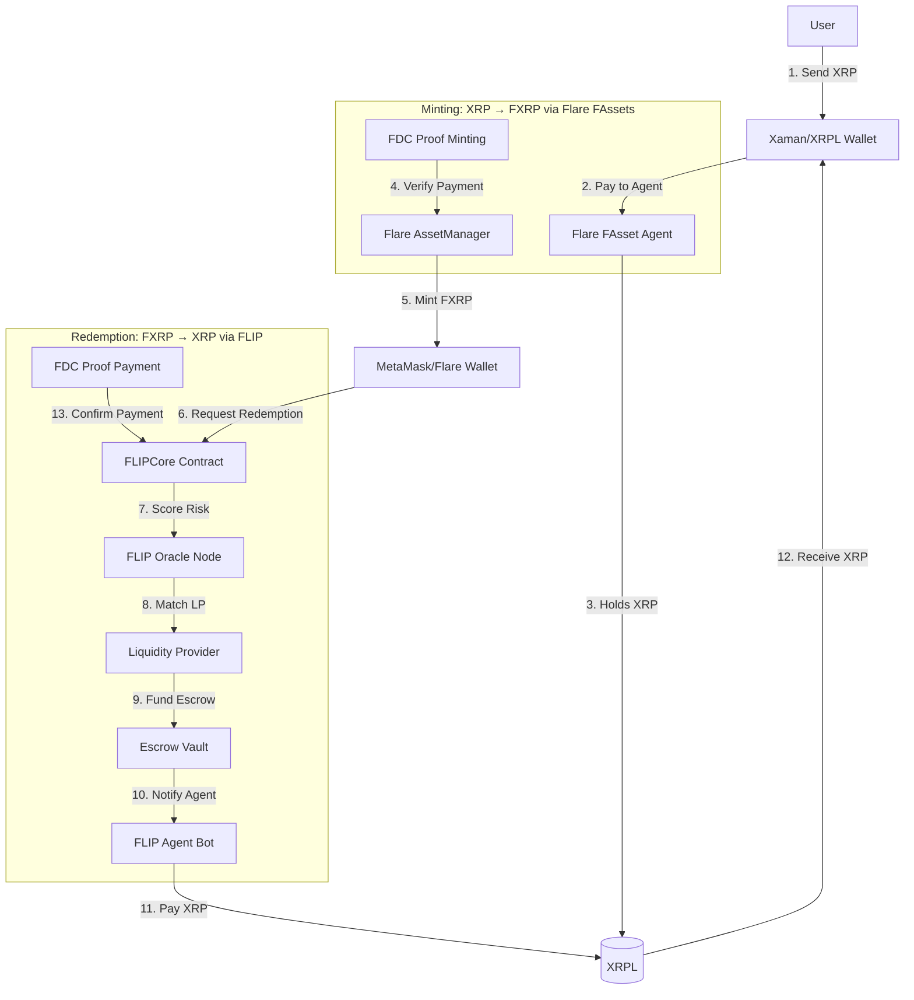

# Full FLIP v2 Testnet Integration Plan

## Architecture Overview



## Critical Gaps Identified

### 1. NO ACTUAL AGENT IMPLEMENTATION

**Problem**: FLIP burns FXRP but no one pays XRP to users.

**Files Affected**:

- Missing: `agent/` directory entirely
- [`contracts/FLIPCore.sol`](contracts/FLIPCore.sol) - has escrow logic but no payout
- [`contracts/EscrowVault.sol`](contracts/EscrowVault.sol) - emits events but doesn't transfer

**Why Flare Could Call BS**: "You burn user's FXRP but never give them XRP back. This is just a token destroyer."

### 2. LP FUNDS ARE FAKE

**Problem**: LPs "deposit" but funds aren't actually held or transferred.

**Files Affected**:

- [`contracts/LiquidityProviderRegistry.sol`](contracts/LiquidityProviderRegistry.sol) lines 104-133 - receives `msg.value` but doesn't store it
- [`contracts/EscrowVault.sol`](contracts/EscrowVault.sol) lines 99-124 - creates escrow but doesn't hold funds
- [`contracts/SettlementReceipt.sol`](contracts/SettlementReceipt.sol) lines 132-150 - "In production, transfer funds" comment

**Why Flare Could Call BS**: "Your LPs don't actually provide liquidity. Users approve but get nothing."

### 3. NO FDC INTEGRATION

**Problem**: FDC attestation functions exist but are never called.

**Files Affected**:

- [`contracts/FLIPCore.sol`](contracts/FLIPCore.sol) lines 324-363 - `handleFDCAttestation()` exists but nothing calls it
- Missing: FDC proof submission scripts
- Missing: FDC monitoring service

**Why Flare Could Call BS**: "You claim FDC adjudicates but you never actually verify anything on-chain."

### 4. NO XRPL INTEGRATION

**Problem**: No way to send/receive XRP payments.

**Missing**:

- XRPL wallet connection in frontend
- XRPL payment monitoring
- XRPL payment reference handling

**Why Flare Could Call BS**: "This isn't a bridge. It's a Flare-only app that doesn't touch XRP Ledger."

### 5. NO MINTING FLOW

**Problem**: Users can't get FXRP to use with FLIP.

**Missing**:

- [`frontend/app/mint/page.tsx`](frontend/app/mint/page.tsx) - doesn't exist
- Flare AssetManager integration
- Minting wizard (reserve → pay → proof → execute)

**Why Flare Could Call BS**: "Where do users get FXRP? This is only half a bridge."

## Implementation Plan

### Phase 1: Minting Flow (Use Flare's FAssets)

**Goal**: Users can mint FXRP from XRP using Flare's AssetManager.

#### 1.1 Create Minting Frontend Page

**Files to Create**:

- `frontend/app/mint/page.tsx` - Step-by-step minting wizard
- `frontend/lib/fassets.ts` - AssetManager integration helpers
- `scripts/fassets/mintingFlow.ts` - Backend minting scripts

**Implementation**:

```typescript
// frontend/app/mint/page.tsx structure
1. Step 1: Choose Agent (fetch from AssetManager.getAvailableAgentsDetailedList())
2. Step 2: Reserve Collateral (call AssetManager.reserveCollateral())
3. Step 3: Connect XRPL Wallet (Xaman/Bifrost integration)
4. Step 4: Send XRP to Agent (with payment reference memo)
5. Step 5: Wait for XRPL finalization
6. Step 6: Get FDC Proof (fetch from Data Availability Layer)
7. Step 7: Execute Minting (call AssetManager.executeMinting())
8. Step 8: Success - Show FXRP balance
```

**Key Functions**:

- `reserveCollateral(agent, lots, fee)` from AssetManager
- `executeMinting(proof, collateralReservationId)` from AssetManager
- FDC proof fetching from `https://coston2-api.flare.network/api/v0/fdc/get-proof`

#### 1.2 XRPL Wallet Integration

**Files to Create**:

- `frontend/lib/xrpl.ts` - XRPL connection helpers
- `frontend/components/XRPLWalletConnect.tsx` - XRPL wallet button

**Implementation**:

- Xaman SDK integration for mobile/desktop
- xrpl.js for direct XRPL connection
- Display XRP balance alongside FXRP balance
- Transaction signing and submission

### Phase 2: Agent Implementation

**Goal**: Automated bot that pays XRP to users after FLIP redemptions.

#### 2.1 Create FLIP Agent Service

**Files to Create**:

- `agent/main.go` - Main agent service
- `agent/xrpl_client.go` - XRPL connection
- `agent/event_monitor.go` - Monitor EscrowCreated events
- `agent/payment_processor.go` - Send XRP payments
- `agent/fdc_submitter.go` - Submit FDC proofs
- `agent/config.yaml` - Agent configuration

**Implementation Flow**:

```go
// agent/main.go
1. Monitor FLIPCore contract for EscrowCreated events
2. Extract redemption details (user XRPL address, amount, payment reference)
3. Send XRP payment to user's XRPL address with payment reference memo
4. Wait for XRPL finalization (4-5 seconds)
5. Fetch FDC proof of payment from Data Availability Layer
6. Submit proof to FLIPCore.handleFDCAttestation()
```

**Key Functions**:

- `MonitorEscrowEvents()` - listen to blockchain
- `SendXRPPayment(address, amount, memo)` - XRPL payment
- `GetFDCProof(txHash)` - fetch proof
- `SubmitFDCProof(redemptionId, proof)` - call contract

#### 2.2 FDC Integration

**Files to Create**:

- `scripts/fdc/getPaymentProof.ts` - Fetch FDC proofs
- `scripts/fdc/submitProof.ts` - Submit to FLIPCore

**Implementation**:

```typescript
// FDC Proof Flow
1. Agent makes XRP payment with unique payment reference
2. Wait for XRPL transaction finalization
3. Prepare attestation request (Payment type)
4. Submit to FDC verifier
5. Wait for FDC round confirmation (~3-5 minutes)
6. Fetch proof from Data Availability Layer
7. Submit to FLIPCore.handleFDCAttestation()
```

**API Endpoints**:

- Verifier: `https://verifier-coston2.flare.network/verifier/xrp/Payment/prepareRequest`
- DA Layer: `https://coston2-api.flare.network/api/v0/fdc/get-proof-round-id-bytes`

### Phase 3: Fix LP Funding Mechanism

**Goal**: LPs actually provide real FLR that gets paid to users.

#### 3.1 Fix LiquidityProviderRegistry

**File to Modify**: [`contracts/LiquidityProviderRegistry.sol`](contracts/LiquidityProviderRegistry.sol)

**Changes**:

```solidity
// Line 104-133: depositLiquidity()
// BEFORE: Accepts msg.value but doesn't store it
// AFTER: Store funds in contract balance

mapping(address => uint256) public lpBalances; // Add this

function depositLiquidity(...) external payable {
    require(msg.value == _amount, "Amount mismatch");
    
    // Store the funds
    lpBalances[msg.sender] += _amount;
    position.depositedAmount += _amount;
    // ... rest of logic
}

// Line 170-215: matchLiquidity()
// Transfer matched LP's funds to EscrowVault
function matchLiquidity(...) external onlyAuthorized {
    // ... matching logic ...
    
    // Actually transfer funds to EscrowVault
    lpBalances[matchedLP] -= _amount;
    payable(address(escrowVault)).transfer(_amount);
}
```

#### 3.2 Fix EscrowVault

**File to Modify**: [`contracts/EscrowVault.sol`](contracts/EscrowVault.sol)

**Changes**:

```solidity
// Line 99-124: createEscrow()
// AFTER: Receive and hold the funds
receive() external payable {} // Add this to accept FLR

function createEscrow(...) external payable onlyAuthorized {
    require(msg.value == _amount, "Insufficient escrow funds");
    
    // Hold the funds in this contract
    escrows[_redemptionId] = Escrow({
        // ... existing fields ...
    });
}

// Line 132-160: releaseOnFDC()
// AFTER: Actually transfer funds
function releaseOnFDC(...) external onlyAuthorized {
    // ... existing logic ...
    
    if (_success) {
        address recipient = escrow.lpFunded ? escrow.lp : escrow.user;
        payable(recipient).transfer(escrow.amount); // ADD THIS
    }
}
```

#### 3.3 Fix SettlementReceipt Redemption

**File to Modify**: [`contracts/SettlementReceipt.sol`](contracts/SettlementReceipt.sol)

**Changes**:

```solidity
// Line 132-150: redeemNow()
// BEFORE: Just emits event
// AFTER: Actually transfer funds from EscrowVault

function redeemNow(uint256 _receiptId) external {
    // ... existing validation ...
    
    // Calculate payout
    uint256 haircutAmount = (metadata.amount * metadata.haircutRate) / 1000000;
    uint256 redeemAmount = metadata.amount - haircutAmount;
    
    metadata.redeemed = true;
    
    // Request payout from EscrowVault
    IEscrowVault(escrowVault).payoutReceipt(
        metadata.redemptionId,
        msg.sender,
        redeemAmount
    ); // ADD THIS
    
    emit ReceiptRedeemed(...);
}
```

### Phase 4: Enhanced Frontend

#### 4.1 Create LP Dashboard

**Files to Create**:

- `frontend/app/lp/page.tsx` - LP dashboard
- `frontend/app/lp/deposit/page.tsx` - Deposit liquidity form
- `frontend/app/lp/withdraw/page.tsx` - Withdraw form

**Features**:

- Deposit FLR with parameters (minHaircut, maxDelay)
- View current LP position (deposited, available, earned)
- Withdraw liquidity
- View matched redemptions and earnings

#### 4.2 Enhanced Redemption Page

**File to Modify**: [`frontend/app/redeem/page.tsx`](frontend/app/redeem/page.tsx)

**Add**:

- XRPL address input (where to receive XRP)
- Real-time XRPL payment status tracking
- Link to XRPL explorer to see payment
- XRP balance display (before/after)
- Receipt redemption buttons (Redeem Now vs Wait for FDC)

#### 4.3 Status Dashboard

**File to Modify**: [`frontend/app/status/page.tsx`](frontend/app/status/page.tsx)

**Add**:

- Agent status (online/offline, XRP balance)
- LP statistics (total liquidity, active LPs, avg haircut)
- Recent redemptions with XRPL tx hashes
- FDC confirmation status

### Phase 5: Testing & Demo Setup

#### 5.1 Deploy Updated Contracts

**Script to Create**: `scripts/deploy-v3-with-funding.ts`

**Steps**:

1. Deploy updated LiquidityProviderRegistry
2. Deploy updated EscrowVault
3. Deploy updated SettlementReceipt
4. Deploy updated FLIPCore
5. Configure all contract addresses
6. Verify on Coston2 explorer

#### 5.2 Set Up Demo LPs

**Script to Create**: `scripts/demo/setupDemoLPs.ts`

**Implementation**:

```typescript
// Fund 3 demo LPs with real FLR
1. LP1: 10,000 FLR, 1% min haircut, 1 hour max delay
2. LP2: 5,000 FLR, 0.5% min haircut, 30 min max delay
3. LP3: 20,000 FLR, 2% min haircut, 2 hour max delay

// Call lpRegistry.depositLiquidity() for each
```

#### 5.3 Set Up Demo Agent

**Script to Create**: `scripts/demo/setupDemoAgent.ts`

**Steps**:

1. Create XRPL testnet wallet
2. Fund with 10,000 XRP from Coston2 faucet
3. Configure agent with wallet seed
4. Start agent service: `cd agent && go run main.go`
5. Verify agent is monitoring events

#### 5.4 End-to-End Test

**Script to Create**: `scripts/demo/e2eTest.ts`

**Test Flow**:

```typescript
// Complete flow test
1. User mints 10 FXRP (via Flare AssetManager)
   - Reserve collateral
   - Send 10.025 XRP to agent
   - Get FDC proof
   - Execute minting
   - Verify FXRP balance = 10

2. User requests redemption (via FLIP)
   - Approve FXRP to FLIPCore
   - Request redemption of 5 FXRP
   - Verify: FXRP balance = 5, Receipt NFT minted

3. Oracle processes (automatic)
   - Oracle scores redemption
   - LP matched (e.g., LP1 with 1% haircut)
   - Escrow created with LP funds

4. Agent pays XRP (automatic within 1 minute)
   - Agent detects EscrowCreated event
   - Sends 4.95 XRP to user's XRPL address
   - Submits FDC proof

5. User redeems receipt
   - Calls redeemNow() on SettlementReceipt
   - Receives 4.95 FLR from EscrowVault
   - Verify: XRP balance increased by ~4.95

6. FDC confirms (after ~5 minutes)
   - FDC proof verified on-chain
   - Escrow released
   - Redemption finalized
```

## Security Considerations

### 1. LP Fund Security

- Use time-locks for withdrawals
- Implement max LP exposure limits
- Add emergency pause for suspicious activity

### 2. Agent Security

- Hot wallet for operations, cold wallet for reserves
- Multi-sig for large agent wallets
- Rate limiting on XRP payments

### 3. FDC Proof Verification

- Always verify FDC merkle proofs on-chain
- Check payment references match
- Validate XRPL transaction finalization

## Documentation to Create

### User Guides

1. **MINTING_GUIDE.md** - How to mint FXRP from XRP
2. **REDEMPTION_GUIDE.md** - How to redeem FXRP to XRP via FLIP
3. **LP_GUIDE.md** - How to become an LP and earn fees

### Technical Docs

1. **AGENT_SETUP.md** - How to run a FLIP agent
2. **FDC_INTEGRATION.md** - FDC proof flow details
3. **CONTRACT_ADDRESSES.md** - All deployed addresses

### Testing Docs

1. **TESTNET_SETUP.md** - Complete Coston2 setup guide
2. **E2E_TEST.md** - End-to-end testing procedures

## Deliverables Checklist

- [ ] Minting frontend page with step-by-step wizard
- [ ] XRPL wallet integration (Xaman + xrpl.js)
- [ ] FLIP Agent service in Go (monitors, pays, submits proofs)
- [ ] Updated contracts with actual fund transfers
- [ ] LP dashboard (deposit, withdraw, earnings)
- [ ] Enhanced redemption page with XRPL tracking
- [ ] FDC proof fetching and submission
- [ ] Demo LP setup with real FLR
- [ ] Demo agent with real XRP
- [ ] End-to-end test script
- [ ] Complete documentation
- [ ] Video walkthrough of full flow

## Timeline Estimate

- **Phase 1** (Minting Flow): 2-3 days
- **Phase 2** (Agent): 3-4 days
- **Phase 3** (LP Funding): 1-2 days
- **Phase 4** (Frontend): 2-3 days
- **Phase 5** (Testing): 2-3 days

**Total**: ~10-15 days for complete implementation

## Next Steps

1. Confirm architecture and approach
2. Start with Phase 1 (Minting) to get FXRP flowing
3. Build Agent (Phase 2) for actual XRP payments
4. Fix LP funding (Phase 3) for real liquidity
5. Polish frontend (Phase 4) for great UX
6. Test everything (Phase 5) to catch issues
7. Deploy and demo on Coston2

This plan addresses every gap that could make Flare say "your app is bullshit" and creates a real, working cross-chain bridge demo.