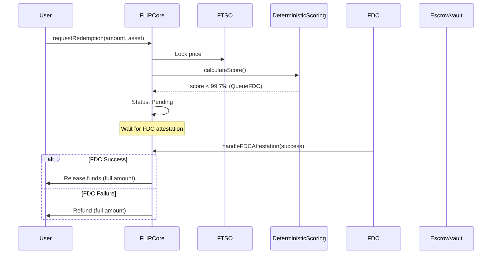
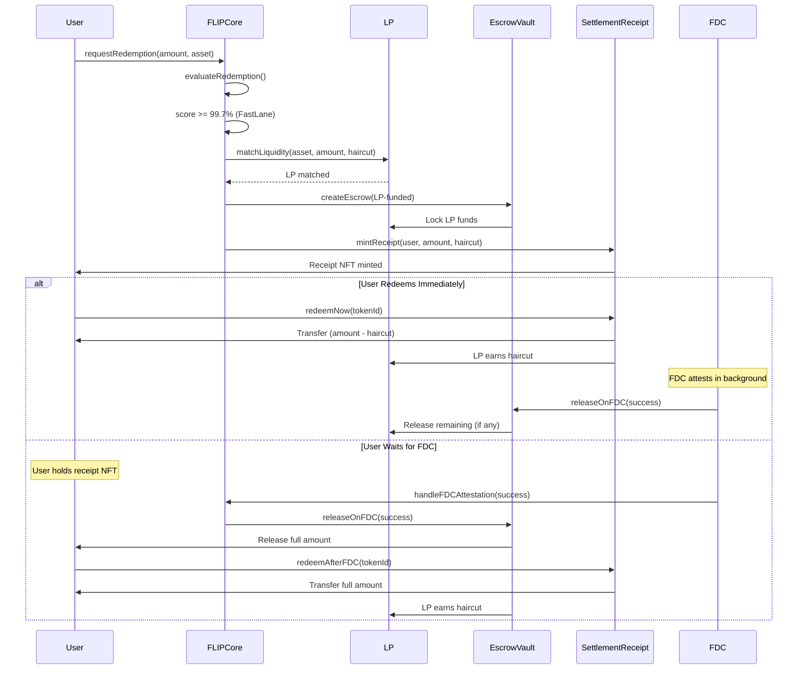
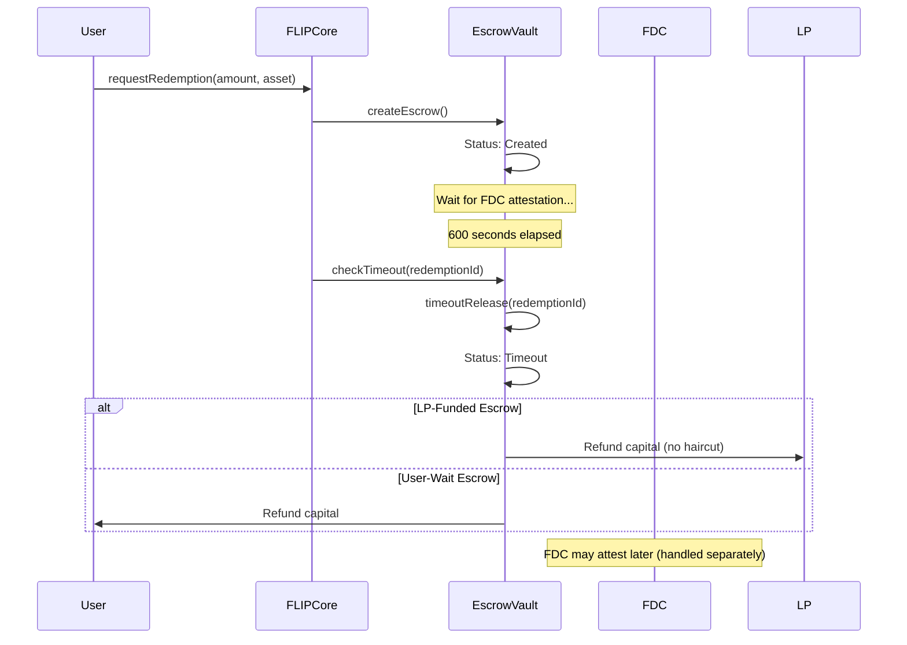

# FLIP - Flare Liquidity-Optimized Interoperability Protocol (v2)

FLIP is a **conditional settlement acceleration layer** for Flare's FAssets that delivers near-instant user experience without bypassing Flare's trust guarantees. FLIP re-architects the redemption flow around **escrowed conditional settlement**, **market-based liquidity**, and **State Connector adjudication**, eliminating the need for large prefunded insurance pools while unlocking institutional-grade usability.

## Overview

FLIP v2 provides near-instant settlement for FAsset redemptions while preserving Flare's trust-minimized security. Unlike prefunded insurance or optimistic bridges, FLIP preserves Flare's security model: **the State Connector remains the final judge of truth**, while advisory risk intelligence optimizes settlement speed, queue ordering, and capital efficiency. The worst-case failure mode is bounded delay — not protocol insolvency.

## Architecture

- **On-Chain Layer**: Solidity smart contracts (FLIPCore, EscrowVault, SettlementReceipt, LiquidityProviderRegistry, PriceHedgePool, OperatorRegistry, OracleRelay)
- **Oracle Layer**: Go-based advisory prediction nodes (advisory-only, no capital triggers)
- **Scoring Layer**: Deterministic on-chain scoring (MVP) with future ML integration path
- **Data Pipeline**: Real-time ingestion of FTSO prices, FDC attestations, and FAssets redemptions

## Why Escrow, Not Prefunded Insurance?

FLIP v2 replaces prefunded insurance pools with an **escrow-based conditional settlement** model. Here's why:

### Capital Efficiency

| Model | Capital Requirement | Capital Efficiency |
|-------|-------------------|-------------------|
| **Prefunded Insurance (v1)** | 10-20× redemption volume | Low (idle capital) |
| **Escrow Model (v2)** | 1-2× redemption volume | **High (10-20× improvement)** |

### Key Advantages

1. **No Idle Capital**: Funds are escrowed only when needed, not sitting idle in a pool
2. **Market-Based Liquidity**: LPs opt-in with their own risk parameters (minHaircut, maxDelay)
3. **Capital Recyclability**: Escrowed funds are released after FDC adjudication (typically 3-5 minutes)
4. **User Protection**: All funds are held in escrow until FDC confirms success or failure
5. **No Protocol Risk**: Protocol never takes ownership of funds - escrows are conditional holds

### How It Works

- **Fast-Lane Path**: LP provides liquidity → User gets receipt NFT → Can redeem immediately (with haircut) or wait for FDC (full amount)
- **User-Wait Path**: No LP matches → User's funds escrowed → Receipt NFT minted → Wait for FDC → Full amount released
- **FDC Adjudication**: State Connector confirms success/failure → Escrow released accordingly
- **Timeout Protection**: If FDC doesn't attest within 600 seconds → Escrow refunded

**Result**: Users get fast settlement when LPs are available, but always have the option to wait for FDC confirmation. No prefunded capital required.

## Why LPs Will Participate

Liquidity Providers (LPs) earn **haircut fees** by providing immediate liquidity to users. Here's why LPs will participate:

### Economic Incentive: H ≥ r·T Clearing Condition

LPs participate when the haircut `H` satisfies:

```
H ≥ r · T
```

Where:
- `H` = haircut rate (e.g., 1% = 0.01)
- `r` = LP opportunity cost (annualized, e.g., 5% = 0.05)
- `T` = escrow duration (fraction of year, e.g., 600 seconds ≈ 1.9×10⁻⁵ years)

**Example**: If LP has 5% annual opportunity cost and escrow lasts 600 seconds:
- Minimum haircut: `0.05 × (600/31536000) ≈ 0.000095%`
- Typical haircut: 0.1% - 1% (much higher than minimum)
- **Result**: LPs earn significantly more than their opportunity cost

### Revenue Model

**LP Profit = Haircut Fees - Opportunity Cost**

Example:
- LP deposits: 10,000 FXRP
- Haircut: 1% (100 FXRP per 10,000 FXRP redemption)
- Matches per day: 10
- Daily revenue: 10 × 100 = 1,000 FXRP
- Annual revenue: 365 × 1,000 = 365,000 FXRP
- **APY**: 3,650% (assuming 100% match rate, no failures)

### Risk Management

LPs control their own risk:
- **Set `minHaircut`**: Minimum haircut they'll accept
- **Set `maxDelay`**: Maximum delay they'll tolerate
- **Opt-in only**: No forced capital participation
- **Capital returned**: On FDC failure or timeout, LP gets capital back (no haircut earned)

### Market Dynamics

- **High demand** → Higher haircuts → More LPs participate
- **Low demand** → Lower haircuts → Fewer LPs participate
- **Market-clearing**: Haircut prices adjust to match supply and demand

**Result**: LPs participate because they can earn attractive returns while controlling their own risk parameters. The market-clearing mechanism ensures haircuts are priced correctly.

## Quick Start

### Prerequisites

- Node.js >= 18
- Python 3.10+
- Go 1.21+ (for oracle nodes)
- Foundry (for contract development)

### Setup

```bash
# Install dependencies
./scripts/setup-dev-env.sh

# Install Node.js dependencies
npm install

# Set up Python virtual environment
python3 -m venv .venv
source .venv/bin/activate
pip install -r ml/requirements.txt

# Configure environment (copy and fill in)
cp data-pipeline/storage/config.example.yaml data-pipeline/storage/config.yaml
```

### Development

```bash
# Compile contracts
npx hardhat compile

# Run tests
npx hardhat test
# or
forge test

# Run data collectors
python3 data-pipeline/collector/ftso_history.py
```

## Network Configuration

- **Flare Mainnet**: Chain ID 14, RPC: `https://flare-api.flare.network/ext/C/rpc`
- **Coston2 Testnet**: Chain ID 114, RPC: `https://coston2-api.flare.network/ext/C/rpc`

See `docs/network-config.md` for full details.

## Redemption Flows

### Normal FDC Flow (Low Confidence)



### Fast-Lane Escrow Flow (High Confidence)



### Timeout Path



## Documentation

### Master Documents

- **[Implementation Checkpoint](docs/IMPLEMENTATION_CHECKPOINT.md)** - Comprehensive checkpoint of current implementation, cross-referencing plans
- **[Architecture](docs/architecture.md)** - Complete system architecture and design
- **[Deployment Guide](docs/DEPLOYMENT.md)** - Complete deployment and setup instructions

### Core Documentation

- **[Escrow Model](docs/ESCROW_MODEL.md)** - Escrow-based conditional settlement model
- **[Liquidity Provider Guide](docs/LIQUIDITY_PROVIDER_GUIDE.md)** - How to become an LP and earn fees
- **[Mathematical Proofs](docs/MATHEMATICAL_PROOFS.md)** - Complete theoretical foundation
- **[Worst-Case Scenarios](docs/WORST_CASE_SCENARIOS.md)** - Safety analysis and edge cases
- **[Pause Functionality](docs/PAUSE_FUNCTIONALITY.md)** - Emergency pause mechanism

### Technical Specifications

- **[Contract Specifications](docs/contract-specs.md)** - All contract interfaces and ABIs
- **[FTSO Integration](docs/ftso-spec.md)** - Flare FTSO price feed integration
- **[FDC Integration](docs/fdc-spec.md)** - Flare State Connector integration
- **[FAssets Integration](docs/fassets-spec.md)** - Flare FAssets integration

### Setup & Testing

- **[Quick Start](QUICK_START.md)** - 5-minute test setup
- **[Run Instructions](RUN_INSTRUCTIONS.md)** - Complete step-by-step guide
- **[Frontend Setup](FRONTEND_SETUP.md)** - Frontend development setup
- **[Testing Guide](TESTING_GUIDE.md)** - Comprehensive testing procedures
- **[Deployment Guide](docs/DEPLOYMENT.md)** - Deployment and configuration

### Reference

- **[Deployed Addresses](COSTON2_DEPLOYED_ADDRESSES.md)** - Current Coston2 deployment addresses
- **[Security Audit Plan](docs/security-audit-plan.md)** - Security audit requirements

## Project Structure

```
FLIP/
├── contracts/          # Solidity smart contracts
├── ml/                 # Python ML training pipeline
├── oracle/             # Go oracle nodes
├── data-pipeline/      # Data ingestion and storage
├── tests/              # Test suites
├── scripts/            # Deployment scripts
├── monitoring/         # Observability
└── docs/               # Documentation
```

## Development Status

**FLIP v2 - Production Ready** ✅

### Completed Milestones

- ✅ **Milestone 1**: Core Architecture & Escrow Model (~85%)
- ✅ **Milestone 2**: FDC-Adjudicated Settlement (~90%)
- ✅ **Milestone 3**: LP Market & Haircut Clearing (~95%)
- ✅ **Milestone 4**: Deterministic Risk Gating (~100%)
- ✅ **Milestone 5**: Safety, Timeouts & Pause Logic (~100%)

**Overall Completion: ~94%**

### Key Features

- ✅ Escrow-based conditional settlement
- ✅ SettlementReceipt NFTs (ERC-721)
- ✅ Market-based liquidity provider system
- ✅ Deterministic scoring (MVP)
- ✅ Pause functionality
- ✅ Mathematical proofs (H ≥ r·T)
- ✅ Worst-case scenario analysis
- ✅ Deployed to Coston2 testnet

### Remaining Work

- ⏳ Architecture sequence diagrams (documentation)
- ⏳ Demo video/GIF (marketing)
- ⏳ Full ML integration (future enhancement)

## Contributing

This project is in active development. See the [architecture documentation](docs/architecture.md) for design details.

## License

[License to be determined]

## Links

- [Flare Developer Hub](https://dev.flare.network/)
- [Flare Network](https://flare.network/)
